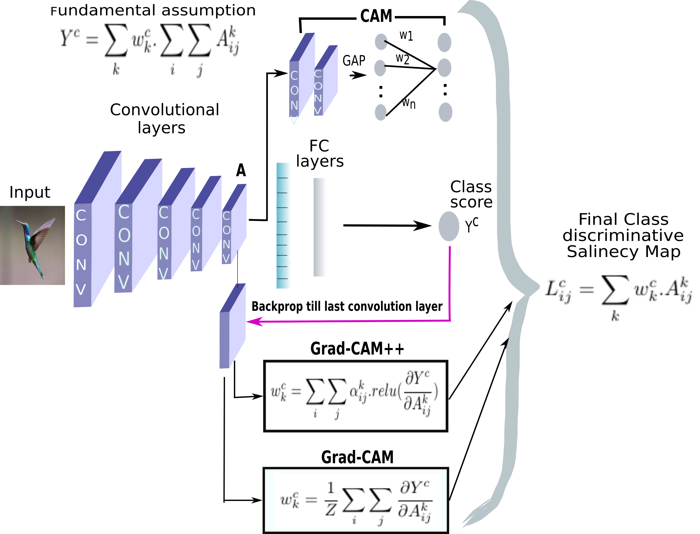
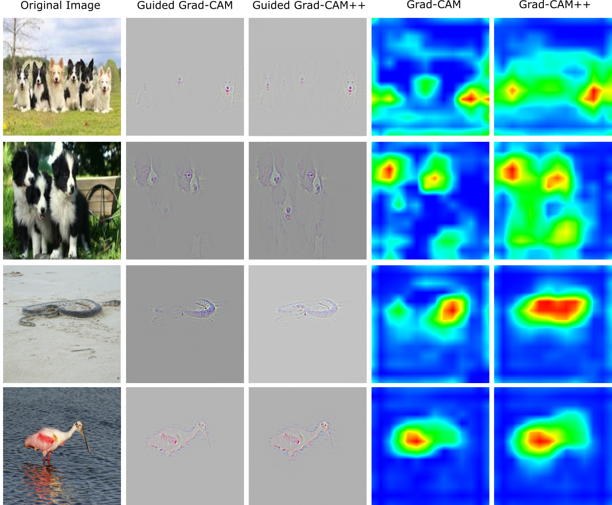

# Grad-CAM++ 

A generalized gradient-based CNN visualization technique
code for the paper:
### Grad-CAM++: Generalized Gradient-based Visual Explanations for Deep Convolutional Networks

To be presented at **WACV 2018**,
<br>
Authors:
<br>
Aditya Chattopadhyay\*,
Anirban Sarkar\*,
Prantik Howlader\* and
Vineeth N Balasubramanian,
<br>
(\* equal contribution)
<br>
##### Gradcam++ Architecture

##### Performance of grad-cam++ with respect to grad-cam

Above we do a comparision of the performance of gradcam++ with respect to grad-cam. Gradcam++ does a better image localization that Gradcam, not only in scenarios where there is more than one object of same class in an image, but also in cases where  there is a single object in an image. 

Implementation in python using tensorflow 1.3.  
Kindly download the pretrained weights of the vgg16 network (vgg16.npy) from the following link, and copy the file to the `models/` subdirectory.  
https://drive.google.com/drive/folders/0BzS5KZjihEdyUjBHcGFNRnk4bFU?usp=sharing

### USAGE:
```python classify.py -f images/water-bird.JPEG -gpu 3 -o output.jpeg ```


#### Arguments:
- `f`: path to input image
- `gpu`: the gpu id to use, 0-indexed
- `l`: class label, default is -1 (chooses the class predicted by the model)
- `o`: Specify output file name for Grad-CAM++ visualization, default is `output.jpeg`. All results would be saved in the `output/` subdirectory.


#### For Help:
```python classify.py -h ```


The above code is for the vgg16 network, pre-trained on imagenet.  
We tested our code on tensorflow 1.3, compatibility with other versions is not guaranteed.


#### Acknowledgements
Parts of the code have been borrowed and modified from: 
##### For the Grad-CAM tensorflow implementation
https://github.com/Ankush96/grad-cam.tensorflow  
https://github.com/insikk/Grad-CAM-tensorflow  
##### For porting pre-trained vgg16-model from caffe model zoo to tensorflow
https://github.com/ry/tensorflow-vgg16  

#### If using this code, please cite our work:
```
 @article{chattopadhyay2017grad,
  title={Grad-CAM++: Generalized Gradient-based Visual Explanations for Deep Convolutional Networks},
  author={Chattopadhyay, Aditya and Sarkar, Anirban and Howlader, Prantik and Balasubramanian, Vineeth N},
  journal={arXiv preprint arXiv:1710.11063},
  year={2017}
}
```
