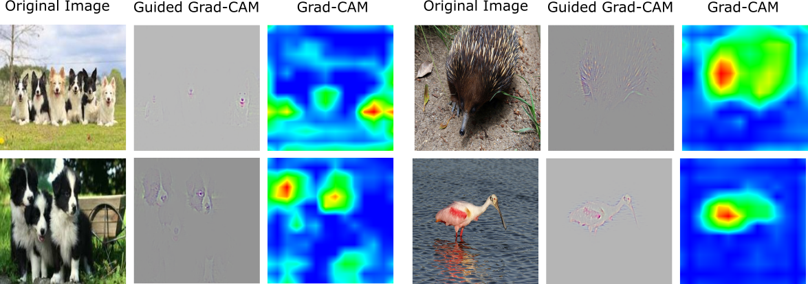

# Grad-CAM++ [WACV 2018]
A generalized gradient-based CNN visualization technique
code for the paper:
### Grad-CAM++: Generalized Gradient-based Visual Explanations for Deep Convolutional Networks


Implementation in python using tensorflow 1.3.  
Kindly download the pretrained weights of the vgg16 network (vgg16.npy) from the following link, and copy the file to the `models/` subdirectory.  
https://drive.google.com/drive/folders/0BzS5KZjihEdyUjBHcGFNRnk4bFU?usp=sharing

### USAGE:
```python classify.py -f images/water-bird.JPEG -gpu 3 -o output.jpeg ```


#### Arguments:
- `f`: path to input image
- `gpu`: the gpu id to use, 0-indexed
- `l`: class label, default is -1 (chooses the class predicted by the model)
- `o`: Specify output file name for Grad-CAM++ visualization, default is `output.jpeg`. All results would be saved in the `output/` subdirectory.


#### For Help:
```python classify.py -h ```


The above code is for the vgg16 network, pre-trained on imagenet.  
We tested our code on tensorflow 1.3, compatibility with other versions is not guaranteed.

###### Deficiencies with present grad-cam


#### Acknowledgements
Parts of the code have been borrowed and modified from: 
##### For the Grad-CAM tensorflow implementation
https://github.com/Ankush96/grad-cam.tensorflow  
https://github.com/insikk/Grad-CAM-tensorflow  
##### For porting pre-trained vgg16-model from caffe model zoo to tensorflow
https://github.com/ry/tensorflow-vgg16  

If using this code, please cite our work:


P.S. Currently our work only supports classification probems with CNN, we plan to soon include support for Image Captionin, VQA and other such CNN based architectures.
